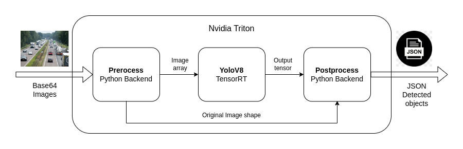

# Triton Yolo repo with base64 image input - json output

## Конвертация модели

Для этого соберем образ с необходимой версией `TensorRT`, `ultralytics`, `model_navigator` на базе контейнера `nvcr.io/nvidia/tritonserver:22.12-py3-sdk`. Используя запускаем контейнер с данным образом и конвертируем модель со стратегией `MinLatencyStrategy`.

```
docker build -t navigator ./yolo_converter
docker run --rm --gpus all -it -v ./yolo_converter:/mnt -v ./triton_repo:/triton_repo navigator -m /mnt/yolov8n.pt --output-dir /triton_repo
```

На выходе получаем сконвертированную модель и конфигурационный файл для Nvidia Triton.

Triton Model Navigator выводит нас следующие параметры модели

```
Strategy: MinLatencyStrategy
Latency: 2.0331 [ms]
Throughput: 491.3982 [infer/sec]
Runner: TensorRT
Model: trt-fp16/model.plan
```

Запустим сервер с моделью и протестируем пропускную способность при разном `batchsize` при помощи `perf_analyzer`

```
docker run -it --shm-size 8gb --gpus all --rm \
    -p 8000:8000 -p 8001:8001 -p 8002:8002 \
    -v ./triton_repo:/app/triton_repo \
    nvcr.io/nvidia/tritonserver:22.12-py3 \
    tritonserver --model-repository /app/triton_repo
```


Как можно заметить лучший результат мы получаем при размерах батча 4 и 8. Остановимся пока на `batchsize=8`

## Инференс модели

Для решения задачи в Python Backend используются пакеты `numpy` и `cv2`. Поэтому необходимо собрать python окружение с помощью `conda-pack`. Также необходимы библиотека `libGL`, для этого соберем образ на базе базового `nvcr.io/nvidia/tritonserver:22.12-py3`

```
docker build -t triton .
```

Ансамбль имеет следующую архитектуру.



Можно запустить полученный тритон репозиторий. Затем перейтий в `jupyter notenook` - `client.ipynb` и проверить его работу

```
docker run -it --shm-size 8gb --gpus all --rm \
-p 8000:8000 -p 8001:8001 -p 8002:8002 \
-v ./triton_repo:/app/triton_repo \
-v ./triton_python_env/env.tar.gz:/app/env.tar.gz \
triton tritonserver --model-repository /app/triton_repo
```

